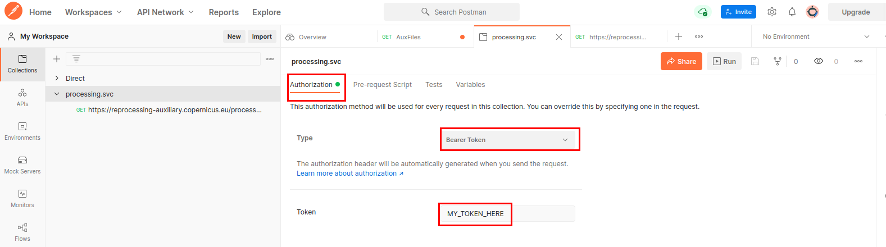
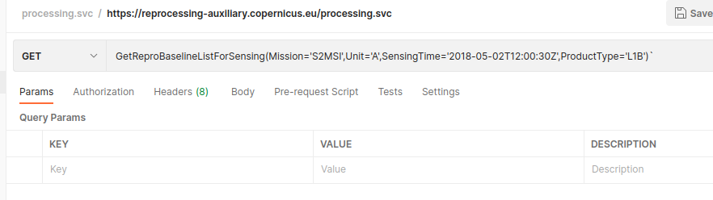

#### Endpoint
The endpoint url for this service is [https://{{site.url}}processing.svc](https://{{site.url}}processing.svc)

#### Function
We will use in this sample the function getReprocessingDataBaseline :

- **getReprocessingDataBaseline**(Mission, Unit, SensingTime, ProductType)

    Query the list of aux file for these particular parameters.

    Sample : `https://{{site.url}}processing.svc/GetReproBaselineListForSensing(Mission='S2MSI',Unit='A',SensingTime='2018-05-02T12:00:30Z',ProductType='L1B')`

#### Steps
First, into the authentication tab, select a Bearer Token and fill it with your token :
{:style="border:1px black solid"}

Then, add the function in the GET field :

{:style="border:1px black solid"}

You can now send the query.

The Result will be a Json, listing, for each L0 file in the specified Time interval, a list of the applicable Aux Files, together with the link for retrieval.

Save the Result
Copy the link of one of the files to the Get field
Send the query (Download Button)
  The application will ask for the destination folder/name
